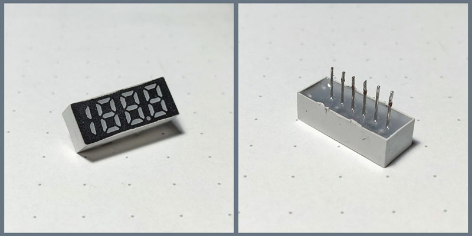

## weird-segment

An Arduino driver for the the unknown 7segment display with 188.8 format,
which I salvaged from [this](https://mk-eshop.cz/fm-transmittery/mkf-bt36charge.html) broken BT-FM transmitter I used in car.



The display has only 6 pins and it was connected to some sort of driver IC.
The display had no part number printed on it.
The driver IC had the part number removed.
No documentation found on internets, apart from something [similar](http://www.ledlight-components.com//photo/ledlight-components/document/13097/DL3-2532RB-6.pdf).

### Installation
Clone the repo and copy over the `lib/WeirdSegment` folder with the actual library.

### Usage
First, write the display buffer using the `write*` functions.
After that, the display must be continuously updated using the `update` function, which outputs
the display buffer into the physical LED segments.

``` cpp

WeirdSegment display;

// Writes the "-.9" on display.
void setup() {
    display.begin(PIN1, PIN2, PIN3, PIN4, PIN5, PIN6);
    display.writeSegment(2, 6); // Activates the G segment of the 3rd digit.
    display.writeDecimalPoint(); // Activates decimal point
    display.writeNumber(9); // Writes number 9
}

void loop() {
    display.update();
}
```

The display buffer should be cleared using the `clear` function before each buffer change.

``` cpp
...

// Displays number of seconds since the start of the program
void loop() {
    display.clear();
    display.writeNumber(millis() / 1000);
    display.update();
}
```

### Features
#### Single segment addressing
The display segments are addressed sequentially from the first segment of the first digit (D1/B),
until the last segment of the last digit (D4/G). 
Decimal point is addressed via separate function.
``` cpp
display.writeSegment(0, 0); // Lights up the first segment of first digit (D1/B)
display.writeSegment(1, 0); // Lights up the first segment of second digit (D2/A)
display.writeSegment(3, 3); // Lights up the bottom segment of last digit (D4/D)
display.writeDecimalPoint(); // Lights up the decimal point
```

#### Displaying numbers
Display is, by design, able to show any number in range 0..1999.
``` cpp
display.writeNumber(256);
```

Combined with decimal point, the floating point number can be shown.
The following code displays the "42.0": 
``` cpp
display.writeNumber(420);
display.writeDecimalPoint();
```

#### Output control
Display output can be enabled and disabled using the following function
``` cpp
// Useful for "flashing" function
bool isOutputEnabled = display.isOutputEnabled();
display.setOutputEnabled(!isOutputEnabled);
```
### The display

The LED segments are 3.3V tolerant.
The current-limiting resistor should be placed before each pin (anything above 22ohm).

I probed the display to find the anode and cathode for each LED segment:

```
D1  D2    D3      D4
    ---   ---     ---
|  |   | |   |   |   |
    ---   ---     ---
|  |   | |   |   |   |
    ---   ---  .  ---
               Dp

Where:

     a
    ---
 f |   | b
    g--
 e |   | c
    ---
     d
```

#### Anode -> Cathode segment pins

Digit 1
```
B 4 -> 3
C 5 -> 3
```

Digit 2
```
A 2 -> 1
B 3 -> 1
C 4 -> 1
D 5 -> 1
E 6 -> 1
F 3 -> 2
G 4 -> 2
```

Digit 3
```
A 1 -> 2
B 1 -> 3
C 1 -> 4
D 1 -> 5
E 1 -> 6
F 5 -> 2
G 6 -> 2
```

Decimal point
```
Dp 6 -> 3
```

Digit 4
```
A 2 -> 3
B 2 -> 4
C 2 -> 5
D 2 -> 6
E 3 -> 4
F 3 -> 5
G 3 -> 6
```

This was a fun weekend project and also an excercise on how to write an Arduino library (not actually published).
